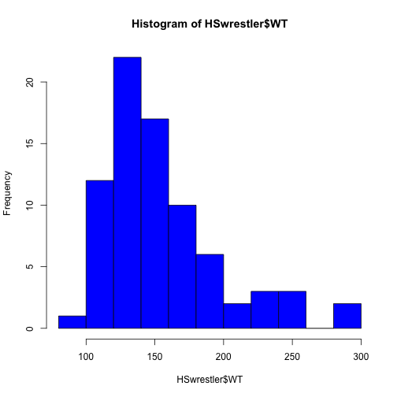

## Basics

1. Edit YAML front matter - a human reaadable data serialization format that takes concepts from programming languages such as C, Perl, and Python, and ideas from KML and the data format of eletctronic mail
(YAML is a recursive acronym for "YAML Ain't Markup Language" and used to mean "Yet Another Markup Language.")

2. Write using R Markdown

3. Use an empty line followed by three dashes to separate slides!

--- .class #id 
## Installation

Step  Description	Code
- require(devtools)
- install_github("slidify","ramnathv")
- install_github("slidifyLibraries", "ramnathv")
- library(slidify)
- author("mydeck")

Then edit in RMarkdown

- slidify("index.RMD")
- publish(user = "USER", repo = "REPO")

---


```
## Loading required package: class
## Loading required package: devtools
## Loading required package: e1071
## Loading required package: lattice
## Loading required package: maps
## Loading required package: MASS
## Loading required package: PASWR
## Loading required package: PASWR2
## Loading required package: ggplot2
## 
## Attaching package: 'PASWR2'
## 
## The following objects are masked from 'package:PASWR':
## 
##     bino.gen, checking.plots, EPIDURAL, EURD, FCD, interval.plot,
##     ksdist, normarea, nsize, ntester, oneway.plots, SBIQ, SDS4,
##     SIGN.test, tsum.test, twoway.plots, z.test, zsum.test
```


---
## Uses Code-Chunks


```r


summary(HSwrestler)
```

```
##       AGE             HT             WT             ABS      
##  Min.   :13.0   Min.   :56.0   Min.   : 93.4   Min.   : 6.0  
##  1st Qu.:15.0   1st Qu.:64.6   1st Qu.:125.1   1st Qu.: 9.0  
##  Median :16.0   Median :67.5   Median :142.2   Median :11.0  
##  Mean   :15.7   Mean   :66.8   Mean   :154.1   Mean   :16.7  
##  3rd Qu.:17.0   3rd Qu.:69.0   3rd Qu.:171.3   3rd Qu.:19.0  
##  Max.   :18.0   Max.   :73.0   Max.   :299.2   Max.   :54.0  
##     TRICEPS         SUBSCAP         HWFAT           TANFAT    
##  Min.   : 6.00   Min.   : 6.0   Min.   : 3.58   Min.   : 6.4  
##  1st Qu.: 7.62   1st Qu.: 8.0   1st Qu.: 8.73   1st Qu.:11.9  
##  Median :10.00   Median : 9.0   Median :11.13   Median :14.0  
##  Mean   :12.96   Mean   :12.9   Mean   :14.24   Mean   :16.7  
##  3rd Qu.:14.00   3rd Qu.:12.0   3rd Qu.:15.42   3rd Qu.:18.2  
##  Max.   :42.00   Max.   :43.0   Max.   :41.89   Max.   :44.9  
##      SKFAT      
##  Min.   : 8.12  
##  1st Qu.: 9.99  
##  Median :11.16  
##  Mean   :15.15  
##  3rd Qu.:15.16  
##  Max.   :41.09
```


---

```r
x <- glm(HSwrestler$HT ~ HSwrestler$WT + HSwrestler$TANFAT + HSwrestler$SKFAT)
summary(x)
```

```
## 
## Call:
## glm(formula = HSwrestler$HT ~ HSwrestler$WT + HSwrestler$TANFAT + 
##     HSwrestler$SKFAT)
## 
## Deviance Residuals: 
##    Min      1Q  Median      3Q     Max  
## -7.789  -0.931   0.224   1.250   5.076  
## 
## Coefficients:
##                   Estimate Std. Error t value Pr(>|t|)    
## (Intercept)        55.5848     1.0993   50.56  < 2e-16 ***
## HSwrestler$WT       0.1119     0.0109   10.29  6.3e-16 ***
## HSwrestler$TANFAT  -0.1503     0.0889   -1.69   0.0952 .  
## HSwrestler$SKFAT   -0.2327     0.0852   -2.73   0.0079 ** 
## ---
## Signif. codes:  0 '***' 0.001 '**' 0.01 '*' 0.05 '.' 0.1 ' ' 1
## 
## (Dispersion parameter for gaussian family taken to be 4.815)
## 
##     Null deviance: 919.35  on 77  degrees of freedom
## Residual deviance: 356.32  on 74  degrees of freedom
## AIC: 349.8
## 
## Number of Fisher Scoring iterations: 2
```

---

```r
hist(HSwrestler$WT, col = "blue")
```

 

---

```r
boxplot(HT ~ WT, data = HSwrestler, main = "Size Distribution")
```

 

